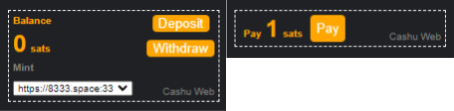

# cashu-webcomponent


cashu-webcomponent is a Webcomponent frontend and Node.js backend allowing websites to add simple drop-in functionality for [Cashu](https://github.com/cashubtc) ecash payments.

# Usage
First, install the backend for node.
```bash
npm i --save cashu-webcomponent-backend
```
Then, import cashu-webcomponent
```javascript
import CashuWebcomponentBackend, { ExpressWebManager, FileStorageManager } from "cashu-webcomponent-backend";
```
Initialize cashu, add a function to receive tokens, add named payments. If you set the same payment ID multiple times, it will just modify the price and/or maximum amount of times it can be paid.
```javascript
const cashu = new CashuWebcomponentBackend(new ExpressWebManager(app), new FileStorageManager("/cashu/test"), ["https://8333.space:3338"]);
cashu.onReceive((cashutoken) => {
	console.log("Cashu token received: " + cashutoken);
});
cashu.addPayment("paywall", {amount: 1, maxtimes: 1});
cashu.addPayment("counter", {amount: 1});
```
You can now add cashu to your frontend by downloading the two scripts from this repo
```html
<script src="cashu-ts-packed.js"></script>
<script src="cashu-webcomponent.js"></script>
```
You can then add the cashu-wallet and cashu-pay components to your site
```html
<cashu-wallet></cashu-wallet>
<cashu-pay cashu-id="counter"></cashu-pay>
<cashu-pay cashu-id="paywall"></cashu-pay>
```
To check if a user has paid a cashu payment, fetch a valid token on the frontend via
```javascript
let paywalltokens = getCashuWebTokens("paywall");
if (paywalltokens.length >= 1) {
	//send one, some, or all of the tokens to the backend
}
```
You can then pass this to the backend in requests and use
```javascript
let paid = await cashu.getTokenType(req.query.token) === "paywall"; //Returns null if the token is not found to be real
if (paid) {
	//do something
}
```
Internally, cashu-webcomponent uses GET endpoints with query parameters, which you can hook into in advanced use cases.
# Install the demo
First, clone the repo
```bash
git clone https://github.com/PandaBear204/cashu-webcomponent.git
```
Then, npm install both the actual backend and the example
```bash
cd cashu-webcomponent/backend
npm install
cd example
npm install
```
Then, start the server
```
npm start
```
In your browser, navigate to `http://127.0.0.1:8000/example/`
# Customize
cashu-webcomponent allows you to customize certain features to work best for your use case
### Custom style
To customize the way cashu-webcomponent looks on your frontend, set window["cashuStyleCSS"] before cashu is initialized. For a template, look at cashu-webcomponent.js
```html
<script src="cashu-ts-packed.js"></script>
<script>window["cashuStyleCSS"] = `
	button {
		height: 100px;
	}
`</script>
<script src="../cashu-webcomponent.js"></script>
```
### Backend database
Have a database? You can pass a custom StorageManager to CashuWebcomponentBackend instead of the file-based one. For a template to implement this, see cashu-webcomponent-backend.js
### Use your own webserver implementation
Not using express.js? You can pass a custom WebManager to CashuWebcomponentBackend instead of the express.js one. For a template to implement this, see cashu-webcomponent-backend.js
